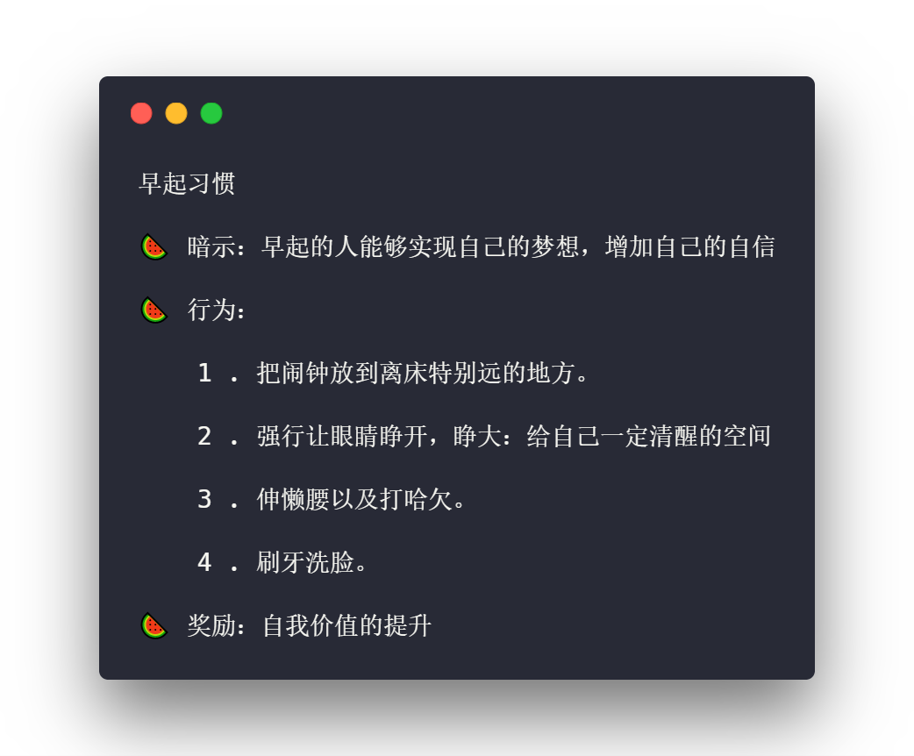

<h3 style="text-align:center;font-weight: 300;" align="center">
  
</h3>

## 学习目标：

想培养的习惯：早睡早起，运动，读书，饮食。

## 内容

**习惯回路**：狗在听了足够多次铃铛并且迟到食物以后，一旦再听到铃声，就会脑补并开始流口水。所以暗示就会产生多巴胺，促使行为的发生。这就是习惯回路。

🍉 1 . **暗示**

🍉 2 . **行为**

🍉 3 . **奖励**

## 方法

#### 坏习惯管理+更正

 

🍑 **饮食**： 记录一天都吃了什么，然后给自己思考的空间。不进入机械化饮食。

🍑 **沉迷游戏** 卸载游戏，让大脑每次不会因为看到游戏而产生多巴胺，进入机械的游戏状态。

🍑 **做事不集中** 记录/反思一天是怎么用自己时间的。 控制被干扰项，因为打扰容易受到干扰进入多巴胺的暗示，导致行为的产生

#### 好习惯养成

 

🍐 **早起**

干货：

1. 如何控制游戏：
2. 如何集中注意：

<!--  🍎  🍊 🍋 🍌  🍇 🍓 🍈 🍒  🍍 🥝 🥑 🍅 🍆 🥒 🥕 🌽 🌶 🥔 🍠 🌰 -->

读书习惯：

#### Bullet 1

🍇 Summary

> example

Elaboration

   

  🍉 1 . **1** ...

  🍉 2 . **2** ...

  🍉 3 . **3** ...

 [⬆ 回到根目录](#说话艺术)

 
 
 
 

#### 图片Source: [Dribbble]()

---

> 
[yuzhoujr.com](http://www.yuzhoujr.com) &nbsp;&middot;&nbsp;
>   [@yuzhoujr](https://github.com/yuzhoujr) &nbsp;&middot;&nbsp;
>   [@yuzhoujr](https://linkedin.com/in/yuzhoujr)
