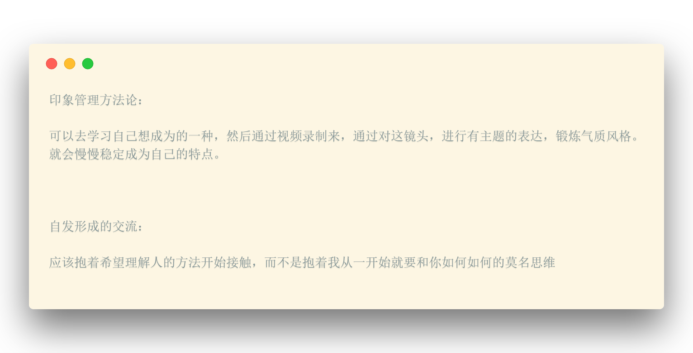

<h3 style="text-align:center;font-weight: 300;" align="center">
  
</h3>

### Title

 Title 

* [`1. 人际关系的建立`](#人际关系的建立)
* [`2. `](#)
* [`3. `](#)
* [`4. `](#)
* [`5. `](#)

 
 
 
 

#### 人际关系的建立
 

🍇 **确定自我** (物质，心理，社会，理想)

在建立关系之前，要对自己有一个大概的自我认知。不然当自己和人社交得到的反馈，与自身对自我的了解有偏差，往往会带来自尊上的冲击。

 

🍏 **印象管理**

1 . 人际关系的属性要单一，尽量不要把例如朋友变成事业的合作伙伴，因为这两种不同的属性会抑制相对应的发展。

2 . **印象匹配**: 第一印象往往会成为对方之后定义你性格的基石，所以对待不同的人，最重要的是要展现自己哪一方面的形象

 

🍎 **建立亲密关系**

**必须要自发形成的**，特别刻意的话，就会变得很功力，但却忽略了两个人沟通互动的过程。我们不应该决定自己和人成为了好友，而是应该是
自然而然的成为好友。这个过程要有互动，分享的故事，慢慢积累的。不知不觉得成为好友。

 总结以及学习方向 

   
  
   
  

 [⬆ 回到根目录](#说话艺术)

 
 
 
 

#2 人际关系的维系

**如何让关系更亲密：**

* a. 共情

共情能力：不带评价的去理解别人。

在现在的公里浮躁社会里，经常交往会带有价值交换的小心思。这种动机驱使之下，情感上的交往避免会受到打折。

1. 朋友倾诉的时候，不要输出价值观。耐心倾听
2. 提问题：一方面表现自己关心，第二方面就是可以引导对方的思路
3. 重复总结确认：对方的感受很零碎，可以帮忙总结一下。

* b. 永远不要停止自我成长

不要停止自我的发展，这样大家互动空间就不会特别的局限。

* c. 多多进行情绪表达。

能够特别的拉近关系。不应该等对方来找自己，应该找时间主动沟通。

**如何在已建立的关系中更包容：**

当已经有稳定的小圈子是，会有排斥陌生人进入的状态。

* a. 提升自信
* b. 消除偏见和刻板印象

#3 人际关系的提升

如何拒绝别人?

  拒绝技巧：

    从拒绝做突破原则的要求开始：  简单直接具体的告诉对方自己为什么不能帮他忙：因为假如直接说没时间，对方可能会觉得还有周旋的余地，可能会继续纠缠：如装可怜，所以不要给对方周旋的余地

如何说服别人：

  传递信息：自身的威信和立场，说服的意图和吸引力。

  作为说服者，如果本身有威信，那么就会更加有力。这说明了我们在做重要的事，前期的铺垫是很重要的。
  为什么说鸡汤没用是因为说服的信息，逆袭的技巧，但客观上都需要时间和耐心去积累基础才能实现的。
  假如自己没有威信，你说什么别人都会存在不相信的思维。所以一定要重视平时形象的管理。

  当形象的层面上来了，就不需要使用说服人的技巧就行，因为平时的形象就足够了。

  另外就是吸引力，个人魅力： 表达层面的渲染，因为表达方式的区别。
    平时没事对着镜头聊一个话题，这样能够的到非常好的锻炼。
    短期奏效：尽量在说服别人的时候，把自己的利益相关放在末端。

  关于说服，对于知识储备充足的大众：提供正反两面的效果比较好。
    客观的去评价一个事情才能够大面积的说服，单一方面的渲染仅仅能针对文化层次不高的群体。

#### 图片Source: [Dribbble](https://cdn.dribbble.com/users/1207383/screenshots/4204835/shoes-overhead.jpg)

---

> 
[yuzhoujr.com](http://www.yuzhoujr.com) &nbsp;&middot;&nbsp;
>   [@yuzhoujr](https://github.com/yuzhoujr) &nbsp;&middot;&nbsp;
>   [@yuzhoujr](https://linkedin.com/in/yuzhoujr)
