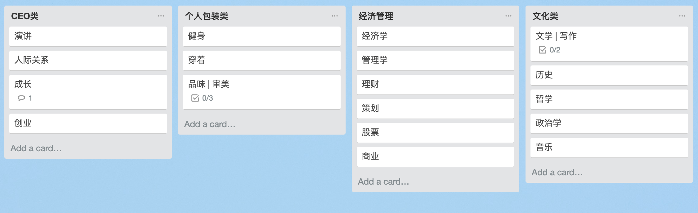

<h3 style="text-align:center;font-weight: 300;" align="center">
  
</h3>

## 学习目标：

**知识分类**，如何从不同角度去思考问题

 
 

#### 开场白

高人聊天例子：闲聊从气候切入，讲到自然气候带。然后种植什么农作物， 延伸到经济结构以及当地社会文化习俗 ，政治是多元化还是单一，所以外交方式是什么样。
世界历史格局地位和影响度。因为这些历史产生什么样的人和名族，这些任何名族有创造了什么文学音乐作品，这些作品会不会又受到文化方面的影响。

 
 

#### 切入点|主题
从例子切入到主题： **知识体系要完整**，不能散状的，

 
 

#### 冲突
那如何让自己的思维具体化，整体化呢？ 是不是要读书破万卷呢？

 🍎 延伸点1: xx几天内读了20本书，但是有用么？囫囵吞枣式读书是否能让知识内化？
 🍐 延伸点2: 前辈会把知识写在纸上，但这种方式是否适合目前互联网时代的节奏？

  
  

#### 答案

 🍉. 要知识体系完整，必须接触不同的学科。

 🍉. 任何的学科，如果要有一个初步的了解。至少要在该行业最具代表性和经典的书中选择3-5本，啃透再延伸。把知识进行系统性的分类，构建全面的知识面。
    文化艺术为例：早期时期的艺术历史了解：寻找最具代表性，观点对立的代表人物的思考方式。这样可以全面客观，生动饱满的增加自己的认知。

 🍉. 看书完之后呢？听讲属于被动学习，需要主动去学习一个东西。参与度要高：

     🍒 实践。学以致用，把学到的观点进行消化，内化，然后输出|交流。

####实践

 
 
 
 

#### 图片Source: [Dribbble](https://cdn.dribbble.com/users/113499/screenshots/4412951/big-dribbble.png)

---

> 
[yuzhoujr.com](http://www.yuzhoujr.com) &nbsp;&middot;&nbsp;
>   [@yuzhoujr](https://github.com/yuzhoujr) &nbsp;&middot;&nbsp;
>   [@yuzhoujr](https://linkedin.com/in/yuzhoujr)
